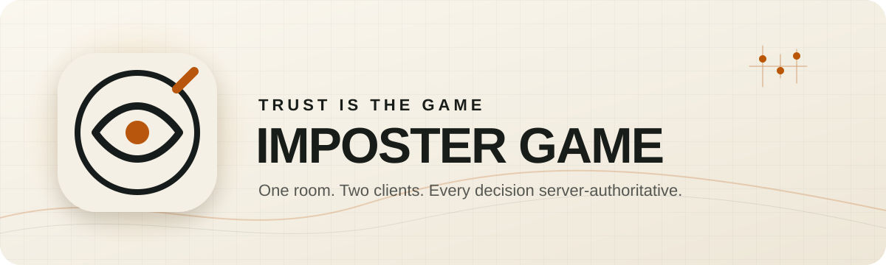

<div align="center">

<picture>
  <source media="(prefers-color-scheme: dark)" srcset="./assets/readme/hero-dark.svg">
  <source media="(prefers-color-scheme: light)" srcset="./assets/readme/hero-light.svg">
  
</picture>

<br>


# Imposter Game

**A private, room-based social deduction experience for the web and Android.**

Players complete real-world tasks, submit photo evidence, call meetings, cast ballots, and try to discover who is quietly sabotaging the room.

[](https://nextjs.org/)
[](https://react.dev/)
[](https://nodejs.org/)
[](https://www.postgresql.org/)
[](https://kotlinlang.org/)
[](https://developer.android.com/compose)
[](https://socket.io/)

[Explore](#what-makes-it-different) · [Architecture](#architecture) · [Quick start](#quick-start) · [Commands](#verification-commands) · [Contracts](#api-contracts) · [Documentation](#documentation)

</div>

---

## Download the Android app

<div align="center">

[](https://github.com/VivekYadav-77/AmongUs/releases/latest/download/imposter-game.apk)

**Android 8.0 or newer · Signed release build · Always points to the latest version**

[View release notes](https://github.com/VivekYadav-77/AmongUs/releases/latest) · [Android setup and privacy](./android%20app/README.md)

</div>

### Install and play

1. Tap **Download Android APK** above from your Android device.
2. Open `imposter-game.apk` after the download completes.
3. If Android asks, allow your browser or file manager to install apps from this source.
4. Complete the installation, open **Imposter Game**, and create or join a room.

> [!IMPORTANT]
> Install the APK only from this repository's official [GitHub Releases](https://github.com/VivekYadav-77/AmongUs/releases). The download button uses the APK produced by the protected, signed Android release workflow. An active backend connection is required to play.

## What makes it different

| | Capability | What it delivers |
| --- | --- | --- |
| **01** | **Guest-first rooms** | Create or join with a room code, nickname, and operative identity—without forcing account creation. |
| **02** | **Physical task play** | Turn real-world activities into assignments with private, bounded photo-evidence uploads. |
| **03** | **Server-authoritative games** | Roles, permissions, phase changes, cooldowns, ballots, and results are decided by the server. |
| **04** | **Live room state** | Authenticated Socket.IO snapshots keep the website and Android client synchronized. |
| **05** | **Meetings and voting** | Discussion, evidence review, private/public voting modes, outcomes, and replay are built into the game loop. |
| **06** | **Account continuity** | Optional Google-backed accounts provide history, profile, device, rejoin, and guest-upgrade flows. |
| **07** | **Host operations** | Hosts configure the game; administrators manage task packs and operational readiness. |
| **08** | **Accessible by design** | Adaptive layouts, light/dark themes, reduced motion, high contrast, semantic controls, and native feedback. |

## One product, two clients

<table>
  <tr>
    <td width="50%" valign="top">
      <h3>Website + backend</h3>
      <p>Next.js and React provide the player and administrator experiences. A custom Node.js server owns HTTP APIs, realtime delivery, game rules, evidence handling, and operational lifecycle.</p>
      <p><a href="./website/"><strong>Open the website project →</strong></a></p>
    </td>
    <td width="50%" valign="top">
      <h3>Native Android</h3>
      <p>Kotlin and Jetpack Compose reproduce the complete mobile journey with secure session storage, adaptive layouts, native media handling, accessibility, and resilient reconnect behavior.</p>
      <p><a href="./android%20app/"><strong>Open the Android project →</strong></a></p>
    </td>
  </tr>
</table>

## Architecture

```text
                            ┌─────────────────────────┐
                            │    PostgreSQL 16+       │
                            │ rooms · games · ballots │
                            └───────────┬─────────────┘
                                        │
┌────────────────────┐       ┌─────────▼─────────┐       ┌────────────────────┐
│ Next.js web client │◄─────►│ Node.js API +     │◄─────►│ Native Android app │
│ React 19           │ HTTPS │ Socket.IO server  │ WSS   │ Kotlin + Compose   │
└────────────────────┘       └─────────┬─────────┘       └────────────────────┘
                                      │
                            ┌─────────▼─────────┐
                            │ Private evidence │
                            │ object storage   │
                            └───────────────────┘
```

The backend is the source of truth. Clients render participant-authorized snapshots and submit commands with state-version and idempotency safeguards; they never calculate hidden roles, winners, or private ballot results locally.

<details>
<summary><strong>Repository map</strong></summary>

```text
AmongUs/
├── .github/workflows/        # Web, backend, Android, and release CI
├── assets/readme/            # Theme-aware repository artwork
├── android app/              # Native Android Gradle project
│   ├── app/                  # Compose application and feature flows
│   ├── core/data/            # API, realtime, repositories, models
│   ├── core/designsystem/    # Tokens, components, artwork, accessibility
│   ├── core/session/         # Android Keystore session persistence
│   └── context/              # Decisions, release state, operations handoff
├── website/                  # Website and backend project
│   ├── app/                  # Next.js App Router surfaces
│   ├── src/client/           # Browser UI, API, realtime, image processing
│   ├── src/server/           # Node.js server lifecycle
│   ├── src/modules/          # Rooms, games, evidence, auth, task packs
│   ├── contracts/            # Realtime schema and fixtures
│   ├── openapi/              # Frozen HTTP contract
│   ├── migrations/           # Ordered PostgreSQL schema migrations
│   ├── tests/                # Unit, integration, browser, visual regression
│   └── docs/                 # Architecture, security, deployment, operations
└── README.md
```

</details>

## Quick start

### Website and backend

**Requirements:** Node.js 24, npm 11+, and PostgreSQL 16 or newer.

```powershell
cd website
Copy-Item .env.example .env
npm ci
npm run migrate:up
npm run dev
```

The local service starts at `http://127.0.0.1:3000`.

- Liveness: `GET /health/live`
- Readiness: `GET /health/ready`
- Full setup: [`website/README.md`](./website/README.md)

<details>
<summary><strong>Environment setup notes</strong></summary>

1. Set `DATABASE_URL` in `website/.env` to a local PostgreSQL database.
2. For Google sign-in, configure the Web client ID, client secret, and exact callback URI described in [`website/.env.example`](./website/.env.example).
3. Keep `.env`, evidence files, credentials, signing material, and production endpoints out of Git.
4. Run `npm run admin:bootstrap` from `website/` to provision the first administrator after migrations complete.

</details>

### Android app

**Requirements:** JDK 17, Android SDK Platform 36, and Build Tools 36.0.0.

```powershell
cd "android app"
.\gradlew.bat quality
.\gradlew.bat assembleDebug
```

For an emulator connected to the local backend:

```powershell
$env:DEBUG_API_BASE_URL = "http://10.0.2.2:3000"
.\gradlew.bat installDebug
```

See [`android app/README.md`](./android%20app/README.md) for physical-device, Google account, staging, signing, and release configuration.

## Verification commands

| Scope | Command | Purpose |
| --- | --- | --- |
| Website/backend | `npm run check` | Formatting, lint, types, unit tests, and contract drift |
| Website/backend | `npm run test:integration` | PostgreSQL-backed integration suite |
| Website/backend | `npm run test:browser` | Playwright journeys and visual regression |
| Website/backend | `npm run build` | Optimized Next.js build and compiled server |
| Android | `gradlew quality` | Formatting, lint, and local unit tests |
| Android | `gradlew connectedQuality` | Connected device/emulator accessibility and UI tests |
| Android | `gradlew bundleRelease` | Validated, shrunk, signed release bundle |

> Website commands run from `website/`. Android commands run from `android app/`.

## API contracts

The website and Android client share versioned, machine-readable contracts:

| Contract | Source |
| --- | --- |
| HTTP API | [`openapi/openapi.json`](./website/openapi/openapi.json) |
| Realtime v1 | [`realtime-v1.schema.json`](./website/contracts/realtime-v1.schema.json) |
| Realtime fixtures | [`contracts/fixtures/`](./website/contracts/fixtures/) |

Contract drift is rejected by the standard verification gate.

## Security and privacy

- Participant and account credentials have separate lifecycles and storage boundaries.
- Passwords are hashed; sessions use bounded, revocable credentials.
- Evidence storage is private and never exposed as a public static directory.
- Signed evidence capabilities, private roles, ballots, and credentials are excluded from logs.
- Rate limiting, request bounds, image validation, state-version checks, and idempotency protect mutations.
- Production configuration fails closed when required origins, signing inputs, or secrets are absent.

## Documentation

| Guide | Description |
| --- | --- |
| [`Android release context`](./android%20app/context/phase-08-release.md) | Mobile compatibility, rollout, monitoring, and acceptance |
| [`Android operations runbook`](./android%20app/context/operations-runbook.md) | Release, backend, upload, realtime, and session incidents |

## Delivery model

```text
Internal verification → closed testing → staged production rollout
```

The current production topology intentionally favors operational clarity: one Node.js application process, one PostgreSQL database, and one private evidence directory behind a TLS/WebSocket-capable reverse proxy. Consult the deployment and operations guides before changing that topology.

---

<div align="center">

**Watch the room. Read the evidence. Trust no one.**

<sub>Built as one server-authoritative experience across web and native Android.</sub>

</div>
