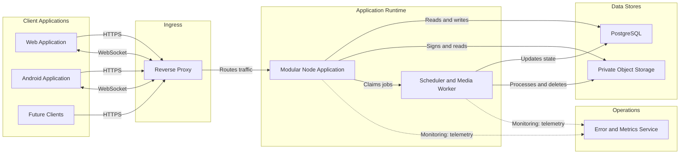

# Architecture

**Status:** Phase 2 administrator authentication and task-pack modules implemented; gameplay modules remain planned.

## 1. Architecture style

Use a **modular monolith** deployed as one persistent Node process. It keeps the solo-developer operational footprint small while preserving boundaries that can later be separated if measurements justify it.

Next.js serves the future web application and versioned HTTP route handlers. A custom Node entry point owns the HTTP server and attaches the realtime transport. The custom entry point must be treated as production code and included explicitly in the build artifact; it must not rely on Next.js standalone output automatically tracing it.

The backend contract must not depend on React Server Actions. Server Actions may later support web-only presentation conveniences, but the durable web/mobile contract is `/api/v1` plus the realtime protocol.

## 2. System diagram



The worker is an internal module and initially runs in the same deployment. It is drawn separately because it has a distinct execution model and may become a separately scalable process later.

## 3. Internal module boundaries

```text
src/
  server/                 custom HTTP and realtime composition root
  api/                    transport adapters, validation, DTO mapping
  realtime/               authentication, room subscription, snapshot delivery
  modules/
    admin-auth/
    task-packs/
    rooms/
    participants/
    games/
    tasks/
    evidence/
    meetings/
  jobs/                   deadline, expiry, media, and retention handlers
  infrastructure/
    database/
    object-storage/
    observability/
    configuration/
  shared/
    contracts/
    errors/
    security/
```

This is a target boundary, not a requirement to create empty directories before their phase needs them.

Each feature module may contain:

```text
transport/controller -> application service -> domain policy -> repository port
                                                   |
                                           infrastructure adapter
```

- Controllers translate protocol inputs and outputs.
- Application services define use cases and transaction boundaries.
- Domain policies contain pure game rules and state transitions.
- Repositories encapsulate database queries; they do not contain authorization decisions.
- DTO mappers project only fields permitted for the current actor.

Avoid a generic “base repository,” global service locator, or deep enterprise layering. Boundaries should protect rules and secrets, not create ceremony.

## 4. Request and command flow

1. Reverse proxy accepts HTTPS and applies coarse limits.
2. API middleware creates or propagates a request ID.
3. Authentication resolves an administrator or participant principal.
4. Schema validation normalizes input.
5. Controller calls one application use case.
6. The use case checks authorization and loads required records.
7. State-changing game commands lock the game row.
8. Domain logic validates the current phase/version and returns a proposed transition.
9. Repository writes state, event, idempotency result, and deadline in one transaction.
10. The transaction commits before any realtime notification is sent.
11. Realtime publisher sends new-version hints or player-specific snapshots.
12. Controller returns the documented DTO/error envelope.

Notifications can fail after commit without rolling back the command. Clients recover by fetching a snapshot.

## 5. Realtime model

### Responsibilities

- Authenticate the connection using a participant session.
- Authorize subscription to exactly one room/game namespace.
- Track ephemeral socket presence only.
- Deliver `state.changed`, phase/deadline, presence, and terminal-game notifications.
- Support acknowledgement where useful, but never treat acknowledgements as durable state.

### Non-responsibilities

- No role assignment, vote resolution, win checks, or durable timers in socket memory.
- No assumption that every event reaches every device.
- No replay log required for the MVP.

For small rooms, the safest payload is a newly projected player-specific snapshot after important changes. Every message contains `gameId`, `stateVersion`, `type`, and `occurredAt`. If the client receives version 12 after version 10, it calls the snapshot endpoint rather than guessing what version 11 contained.

## 6. Timer and job model

Game deadlines are timestamps stored on the game or meeting. A scheduler polls due work, claims the relevant row with transactional locking, rechecks the phase/version, and applies the same domain transition used by manual commands.

Initial jobs:

- Advance discussion, review, and voting deadlines.
- Transfer host after disconnect grace period.
- Expire inactive lobbies/games.
- Verify or normalize uploaded images.
- Delete retained objects and mark metadata deleted.
- Retry bounded, transient storage operations.

Use PostgreSQL-backed job records only where retries/history are required. Do not introduce an external queue in the initial topology.

## 7. Data architecture

- PostgreSQL is authoritative.
- Database constraints enforce local invariants; services enforce cross-row game rules transactionally.
- Game rows provide the serialization point for conflicting game commands.
- Task text is snapshotted into game-owned records.
- Secret role and real/fake assignment fields are isolated in server-only records and DTOs.
- The event table is an audit/debug aid, not event sourcing.
- Object storage keys are references; signed URLs are short-lived transport capabilities, not stored data.

See `DATABASE_DESIGN.md`.

## 8. Deployment topology

### Initial

```text
Internet
   |
TLS reverse proxy / managed ingress
   |
One persistent Node process
   |--- PostgreSQL
   |--- Private object storage
   `--- Monitoring/error service
```

Requirements:

- WebSocket upgrade support and an idle timeout longer than heartbeat intervals.
- A health check that does not create game state.
- Graceful termination during deployments.
- Database migrations run as a release step, never concurrently from every app replica.
- Secrets supplied through the hosting environment.
- Automated database backups and tested restore instructions.

### Later multi-instance deployment

Do not enable multiple instances merely by changing a replica count. First add a supported shared realtime adapter/pub-sub, distributed job ownership, coordinated cache behavior, and load tests. PostgreSQL remains authoritative; Redis, if introduced, is disposable coordination/cache state.

## 9. Failure behavior

| Failure                        | Required behavior                                                                 |
| ------------------------------ | --------------------------------------------------------------------------------- |
| Client loses network           | Reconnect with session; fetch snapshot; resume if session valid                   |
| Node process restarts          | Connections drop; persisted phase/deadline survives; scheduler catches up         |
| Realtime publish fails         | HTTP command remains committed; clients recover through snapshot/version          |
| Duplicate HTTP command         | Idempotency record returns original compatible result                             |
| Database unavailable           | Reject writes with safe retryable error; do not invent local state                |
| Object store unavailable       | Do not issue/confirm upload; preserve assignment as incomplete or provisional     |
| Image processing fails         | Quarantine/delete object, invalidate submission, reopen assignment, notify player |
| Deadline and user command race | Game-row lock and expected version allow only one valid transition                |
| Host disconnects               | Grace period, then deterministic host transfer                                    |

## 10. Architecture decision records

- [ADR-001](adr/ADR-001-DATABASE-ACCESS.md): Kysely, `pg`, and node-pg-migrate.
- [ADR-002](adr/ADR-002-REALTIME.md): Socket.IO over WebSocket.
- [ADR-003](adr/ADR-003-WEB-CREDENTIALS.md): HttpOnly web cookie and bearer native credential transports.
- ADR-004: Image normalization/metadata stripping library and resource limits.
- [ADR-005](adr/ADR-005-DEPLOYMENT-ARTIFACT.md): provider-neutral OCI artifact; provider selection deferred.
- [ADR-006](adr/ADR-006-TEST-AND-CONTRACT-STACK.md): Vitest and generated OpenAPI 3.1 validation.

The plan intentionally does not lock library versions before implementation begins. Exact versions must be selected from supported releases in Phase 1 and recorded with their operational constraints.

## 11. External technical references

- [Next.js custom server guide](https://nextjs.org/docs/app/guides/custom-server)
- [Next.js self-hosting guide](https://nextjs.org/docs/app/guides/self-hosting)
- [OpenAPI specification](https://spec.openapis.org/oas/)
- [Amazon S3 presigned URL guide](https://docs.aws.amazon.com/AmazonS3/latest/userguide/using-presigned-url.html)
- [PostgreSQL transaction isolation](https://www.postgresql.org/docs/current/transaction-iso.html)
- [PostgreSQL explicit locking](https://www.postgresql.org/docs/current/explicit-locking.html)
