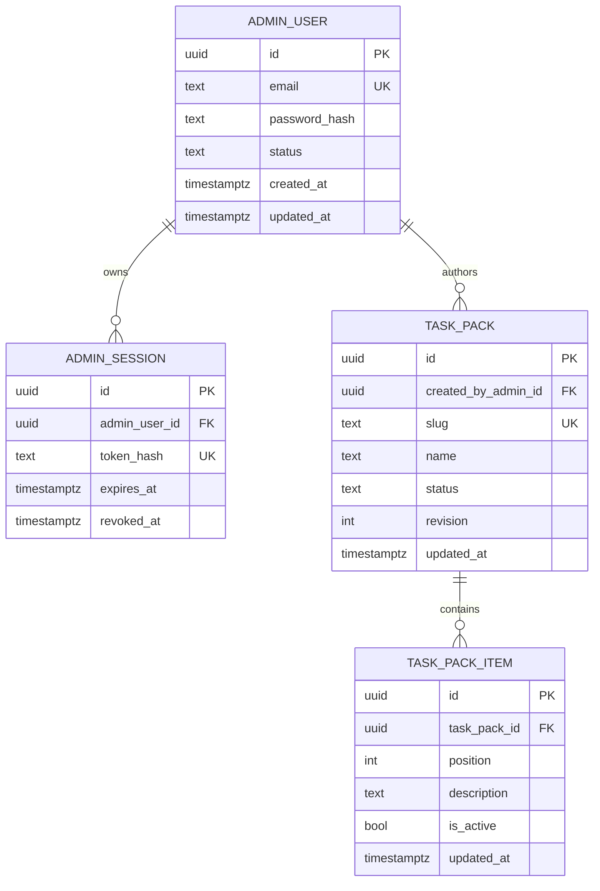
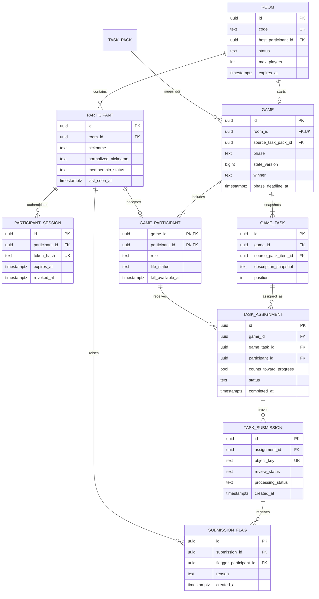
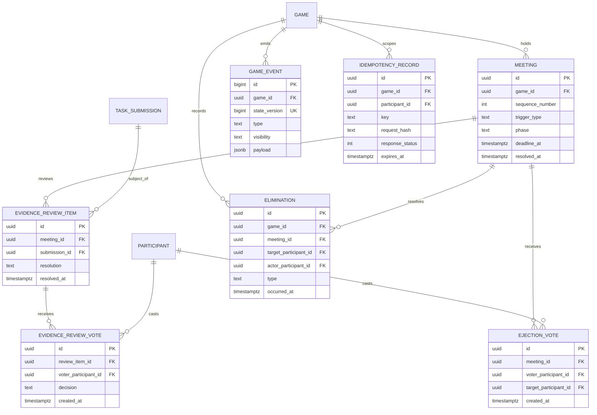

# Database Design

**Status:** Logical schema proposed for review. No migration or ORM schema exists yet.

## 1. Design principles

- PostgreSQL is the only authoritative store for game state.
- Use UUID primary keys for externally addressable records and `bigint` for ordered internal sequences.
- Use `timestamptz` for every timestamp.
- Prefer explicit columns and constraints over unstructured JSON for business-critical state.
- Use text values with `CHECK` constraints initially rather than PostgreSQL enums so controlled additions are easier to migrate.
- Snapshot mutable task-pack content when a game starts.
- Store opaque credential hashes, never raw participant or admin session tokens.
- Store object keys and verified metadata, never permanent signed URLs or image bytes.
- Use hard deletion for expired temporary room data after retention; use status-based archival for reusable task packs and administrators.

The exact DDL and query library will be selected in Phase 1. Names below are the contract for the first migration unless an approved ADR changes them.

## 2. Domain diagrams

### Administration and task catalog

### Room, game, and task state

### Meetings, decisions, and operations

Operational `job` records are omitted from the diagrams because they belong to infrastructure rather than the game domain.

## 3. Table specifications

### `admin_users`

| Column          | Type          | Null | Constraints/notes                    |
| --------------- | ------------- | ---: | ------------------------------------ |
| `id`            | `uuid`        |   No | PK                                   |
| `email`         | `text`        |   No | Unique on normalized lowercase value |
| `password_hash` | `text`        |   No | Never exposed or logged              |
| `status`        | `text`        |   No | Check: `active`, `disabled`          |
| `last_login_at` | `timestamptz` |  Yes | Successful login only                |
| `created_at`    | `timestamptz` |   No | Default current time                 |
| `updated_at`    | `timestamptz` |   No | Application maintained               |

No public registration or soft-delete requirement. Disable an administrator to preserve authorship history.

### `admin_sessions`

| Column            | Type          | Null | Constraints/notes                           |
| ----------------- | ------------- | ---: | ------------------------------------------- |
| `id`              | `uuid`        |   No | PK                                          |
| `admin_user_id`   | `uuid`        |   No | FK to `admin_users`, cascade on delete      |
| `token_hash`      | `text`        |   No | Unique                                      |
| `issued_at`       | `timestamptz` |   No | Default current time                        |
| `expires_at`      | `timestamptz` |   No | Must be after `issued_at`                   |
| `last_used_at`    | `timestamptz` |  Yes | Rate-limited updates                        |
| `revoked_at`      | `timestamptz` |  Yes | Null means not explicitly revoked           |
| `created_ip_hash` | `text`        |  Yes | Optional privacy-preserving security signal |

Index active-session lookup by `token_hash`; cleanup by `expires_at`.

### `task_packs`

| Column                | Type          | Null | Constraints/notes                       |
| --------------------- | ------------- | ---: | --------------------------------------- |
| `id`                  | `uuid`        |   No | PK                                      |
| `created_by_admin_id` | `uuid`        |   No | FK to `admin_users`, restrict delete    |
| `slug`                | `text`        |   No | Unique, stable identifier               |
| `name`                | `text`        |   No | 1–80 display characters after trim      |
| `description`         | `text`        |  Yes | At most 1,000 characters                |
| `status`              | `text`        |   No | Check: `draft`, `published`, `archived` |
| `revision`            | `integer`     |   No | Positive; increment on mutation         |
| `published_at`        | `timestamptz` |  Yes | Required when published by service rule |
| `created_at`          | `timestamptz` |   No | Default current time                    |
| `updated_at`          | `timestamptz` |   No | Application maintained                  |

Index published packs by `(status, name)`. Packs are archived, not deleted, once referenced by a game.

### `task_pack_items`

| Column         | Type          | Null | Constraints/notes                                         |
| -------------- | ------------- | ---: | --------------------------------------------------------- |
| `id`           | `uuid`        |   No | PK                                                        |
| `task_pack_id` | `uuid`        |   No | FK to `task_packs`, cascade only while unreferenced/draft |
| `position`     | `integer`     |   No | Positive; unique with pack ID                             |
| `description`  | `text`        |   No | 1–280 characters after trim                               |
| `is_active`    | `boolean`     |   No | Default true                                              |
| `created_at`   | `timestamptz` |   No | Default current time                                      |
| `updated_at`   | `timestamptz` |   No | Application maintained                                    |

Publishing requires the approved task-count range, initially 10–15 active items.

### `admin_audit_events`

| Column          | Type          | Null | Constraints/notes                                     |
| --------------- | ------------- | ---: | ----------------------------------------------------- |
| `id`            | `uuid`        |   No | PK                                                    |
| `admin_user_id` | `uuid`        |  Yes | FK to `admin_users`; null is allowed after deletion   |
| `action`        | `text`        |   No | Stable security/lifecycle action name                 |
| `target_type`   | `text`        |  Yes | Bounded resource category                             |
| `target_id`     | `uuid`        |  Yes | Resource identifier                                   |
| `request_id`    | `text`        |  Yes | Correlation only                                      |
| `ip_hash`       | `text`        |  Yes | Privacy-preserving security signal                    |
| `outcome`       | `text`        |   No | Check: `success`, `failure`                           |
| `metadata`      | `jsonb`       |   No | Structural facts only; never credentials or edit body |
| `created_at`    | `timestamptz` |   No | Default current time                                  |

### `admin_idempotency_records`

| Column          | Type          | Null | Constraints/notes                                 |
| --------------- | ------------- | ---: | ------------------------------------------------- |
| `admin_user_id` | `uuid`        |   No | Composite PK; FK to `admin_users`, cascade delete |
| `key`           | `text`        |   No | Composite PK; client-generated key                |
| `operation`     | `text`        |   No | Route/resource-scoped operation                   |
| `request_hash`  | `text`        |   No | Rejects reuse with a different request            |
| `response_body` | `jsonb`       |   No | Original admin DTO for replay                     |
| `created_at`    | `timestamptz` |   No | Default current time                              |
| `expires_at`    | `timestamptz` |   No | Initial retention: 24 hours                       |

Concurrent use of the same administrator/key pair is serialized with a transaction advisory lock before the record is read or created.

### `rooms`

| Column                  | Type          | Null | Constraints/notes                                                          |
| ----------------------- | ------------- | ---: | -------------------------------------------------------------------------- |
| `id`                    | `uuid`        |   No | PK                                                                         |
| `code`                  | `text`        |   No | Uppercase normalized short code                                            |
| `status`                | `text`        |   No | `lobby`, `active`, `completed`, `abandoned`, `expired`                     |
| `host_participant_id`   | `uuid`        |  Yes | Deferred FK to participant in this room; null only during creation/cleanup |
| `selected_task_pack_id` | `uuid`        |  Yes | FK to published `task_packs`; required to start                            |
| `max_players`           | `smallint`    |   No | Fixed to 12 by MVP service policy                                          |
| `imposter_count`        | `smallint`    |   No | Server-derived at start: 1 for 4–7, 2 for 8–12                             |
| `tasks_per_crew`        | `smallint`    |   No | Server-derived at start: 3 for 4–7, 4 for 8–12                             |
| `task_phase_seconds`    | `integer`     |   No | Bounded safe range                                                         |
| `discussion_seconds`    | `integer`     |   No | Bounded safe range                                                         |
| `review_seconds`        | `integer`     |   No | Bounded safe range                                                         |
| `voting_seconds`        | `integer`     |   No | Bounded safe range                                                         |
| `created_at`            | `timestamptz` |   No | Default current time                                                       |
| `last_activity_at`      | `timestamptz` |   No | Drives expiry                                                              |
| `expires_at`            | `timestamptz` |   No | Indexed cleanup deadline                                                   |

Use a partial unique index on `code` for non-terminal rooms. Codes may be reused only after the old room is terminal and outside any ambiguity window.

### `participants`

| Column                | Type          | Null | Constraints/notes                         |
| --------------------- | ------------- | ---: | ----------------------------------------- |
| `id`                  | `uuid`        |   No | PK                                        |
| `room_id`             | `uuid`        |   No | FK to `rooms`, cascade on room purge      |
| `nickname`            | `text`        |   No | Display value, bounded                    |
| `normalized_nickname` | `text`        |   No | Unique with room ID                       |
| `avatar_id`           | `text`        |   No | Night Operative catalog identifier        |
| `membership_status`   | `text`        |   No | `joined`, `left`, `removed`               |
| `joined_at`           | `timestamptz` |   No | Default current time                      |
| `last_seen_at`        | `timestamptz` |   No | Presence hint; not every heartbeat writes |
| `disconnected_at`     | `timestamptz` |  Yes | Durable grace-period input                |

Unique `(room_id, normalized_nickname)` and, for joined members, `(room_id, avatar_id)`. A participant record is temporary identity, not an account.

### `participant_sessions`

| Column           | Type          | Null | Constraints/notes                      |
| ---------------- | ------------- | ---: | -------------------------------------- |
| `id`             | `uuid`        |   No | PK                                     |
| `participant_id` | `uuid`        |   No | FK to `participants`, cascade on purge |
| `token_hash`     | `text`        |   No | Unique                                 |
| `issued_at`      | `timestamptz` |   No | Default current time                   |
| `expires_at`     | `timestamptz` |   No | Indexed                                |
| `last_used_at`   | `timestamptz` |  Yes | Rate-limited updates                   |
| `revoked_at`     | `timestamptz` |  Yes | Null when active                       |

The raw token never enters this table.

### `games`

| Column                    | Type          | Null | Constraints/notes                                                            |
| ------------------------- | ------------- | ---: | ---------------------------------------------------------------------------- |
| `id`                      | `uuid`        |   No | PK                                                                           |
| `room_id`                 | `uuid`        |   No | FK to `rooms`, unique for MVP                                                |
| `source_task_pack_id`     | `uuid`        |   No | Historical FK, restrict delete                                               |
| `task_pack_name_snapshot` | `text`        |   No | Stable display name                                                          |
| `phase`                   | `text`        |   No | `task`, `discussion`, `review`, `voting`, `result`, `game_over`, `abandoned` |
| `state_version`           | `bigint`      |   No | Starts at 1; positive                                                        |
| `winner`                  | `text`        |  Yes | Null, `crew`, or `imposters`                                                 |
| `phase_started_at`        | `timestamptz` |   No | Current phase start                                                          |
| `phase_deadline_at`       | `timestamptz` |  Yes | Null only for terminal/non-timed phase                                       |
| `started_at`              | `timestamptz` |   No | Default current time                                                         |
| `ended_at`                | `timestamptz` |  Yes | Required for terminal game by service rule                                   |

Index due games by `phase_deadline_at` where non-null and non-terminal.

### `game_participants`

| Column              | Type          | Null | Constraints/notes                           |
| ------------------- | ------------- | ---: | ------------------------------------------- |
| `game_id`           | `uuid`        |   No | Composite PK, FK to games, cascade on purge |
| `participant_id`    | `uuid`        |   No | Composite PK, FK to participants            |
| `role`              | `text`        |   No | `crew` or `imposter`; server-secret field   |
| `life_status`       | `text`        |   No | `alive`, `killed`, `ejected`                |
| `kill_available_at` | `timestamptz` |  Yes | Used only by imposters; server-secret       |
| `created_at`        | `timestamptz` |   No | Default current time                        |

A composite FK or service check guarantees that participant and game belong to the same room. Index `(game_id, role, life_status)` for win checks.

### `game_tasks`

| Column                 | Type      | Null | Constraints/notes                              |
| ---------------------- | --------- | ---: | ---------------------------------------------- |
| `id`                   | `uuid`    |   No | PK                                             |
| `game_id`              | `uuid`    |   No | FK to games, cascade on purge                  |
| `source_pack_item_id`  | `uuid`    |  Yes | Historical FK; nullable if source later purged |
| `description_snapshot` | `text`    |   No | Immutable after game start                     |
| `position`             | `integer` |   No | Unique with game ID                            |

### `task_assignments`

| Column                   | Type          | Null | Constraints/notes                            |
| ------------------------ | ------------- | ---: | -------------------------------------------- |
| `id`                     | `uuid`        |   No | PK                                           |
| `game_id`                | `uuid`        |   No | Denormalized FK for safe scoped queries      |
| `game_task_id`           | `uuid`        |   No | FK to `game_tasks`, cascade on purge         |
| `participant_id`         | `uuid`        |   No | Part of FK to `game_participants`            |
| `counts_toward_progress` | `boolean`     |   No | Server-secret; true only for crew assignment |
| `status`                 | `text`        |   No | `assigned`, `completed`                      |
| `completed_at`           | `timestamptz` |  Yes | Null when assigned                           |

Unique `(game_task_id, participant_id)`. Index real progress by `(game_id, counts_toward_progress, status)`.

### `task_submissions`

| Column                    | Type          | Null | Constraints/notes                            |
| ------------------------- | ------------- | ---: | -------------------------------------------- |
| `id`                      | `uuid`        |   No | PK                                           |
| `assignment_id`           | `uuid`        |   No | FK to assignments, cascade on purge          |
| `uploader_participant_id` | `uuid`        |   No | Must own assignment by service rule          |
| `object_key`              | `text`        |   No | Unique, server generated                     |
| `content_type`            | `text`        |   No | Verified allowlist value                     |
| `byte_size`               | `bigint`      |   No | Positive, max constrained                    |
| `checksum`                | `text`        |  Yes | Provider-supported integrity value           |
| `processing_status`       | `text`        |   No | `pending`, `accepted`, `rejected`, `deleted` |
| `review_status`           | `text`        |   No | `valid`, `flagged`, `invalid`                |
| `created_at`              | `timestamptz` |   No | Default current time                         |
| `processed_at`            | `timestamptz` |  Yes | Media verification completion                |
| `delete_after`            | `timestamptz` |  Yes | Indexed retention deadline                   |
| `deleted_at`              | `timestamptz` |  Yes | Object deletion audit                        |

Allow submission history. A partial unique index permits at most one current non-invalid/non-deleted submission per assignment.

### `submission_flags`

| Column                   | Type          | Null | Constraints/notes                           |
| ------------------------ | ------------- | ---: | ------------------------------------------- |
| `id`                     | `uuid`        |   No | PK                                          |
| `submission_id`          | `uuid`        |   No | FK to submission, cascade on purge          |
| `flagger_participant_id` | `uuid`        |   No | FK to participant                           |
| `reason`                 | `text`        |  Yes | Optional bounded text or future reason code |
| `created_at`             | `timestamptz` |   No | Default current time                        |
| `resolved_at`            | `timestamptz` |  Yes | Set when review item resolves               |

Unique `(submission_id, flagger_participant_id)`. Self-flag and eligibility require service checks.

### `meetings`

| Column                         | Type          | Null | Constraints/notes                            |
| ------------------------------ | ------------- | ---: | -------------------------------------------- |
| `id`                           | `uuid`        |   No | PK                                           |
| `game_id`                      | `uuid`        |   No | FK to games, cascade on purge                |
| `sequence_number`              | `integer`     |   No | Unique with game ID, positive                |
| `trigger_type`                 | `text`        |   No | `kill`, `task_deadline`, future `emergency`  |
| `trigger_actor_participant_id` | `uuid`        |  Yes | Secret/internal; never public for kill       |
| `reported_participant_id`      | `uuid`        |  Yes | Eliminated target if applicable              |
| `phase`                        | `text`        |   No | `discussion`, `review`, `voting`, `resolved` |
| `deadline_at`                  | `timestamptz` |  Yes | Current subphase deadline                    |
| `created_at`                   | `timestamptz` |   No | Default current time                         |
| `resolved_at`                  | `timestamptz` |  Yes | Terminal timestamp                           |

Only one unresolved meeting per game, enforced with a partial unique index.

### `evidence_review_items`

| Column          | Type          | Null | Constraints/notes               |
| --------------- | ------------- | ---: | ------------------------------- |
| `id`            | `uuid`        |   No | PK                              |
| `meeting_id`    | `uuid`        |   No | FK to meeting, cascade on purge |
| `submission_id` | `uuid`        |   No | FK to submission                |
| `resolution`    | `text`        |  Yes | Null, `valid`, `invalid`        |
| `resolved_at`   | `timestamptz` |  Yes | Null until resolution           |

Unique `(meeting_id, submission_id)`. A submission must not be reviewed again after final resolution.

### `evidence_review_votes`

| Column                 | Type          | Null | Constraints/notes                   |
| ---------------------- | ------------- | ---: | ----------------------------------- |
| `id`                   | `uuid`        |   No | PK                                  |
| `review_item_id`       | `uuid`        |   No | FK to review item, cascade on purge |
| `voter_participant_id` | `uuid`        |   No | FK to participant                   |
| `decision`             | `text`        |   No | `valid` or `invalid`                |
| `created_at`           | `timestamptz` |   No | Default current time                |

Unique `(review_item_id, voter_participant_id)`. Votes become immutable after the review deadline; whether changes before deadline are allowed is an API decision (proposed: replaceable until locked).

### `ejection_votes`

| Column                  | Type          | Null | Constraints/notes                   |
| ----------------------- | ------------- | ---: | ----------------------------------- |
| `id`                    | `uuid`        |   No | PK                                  |
| `meeting_id`            | `uuid`        |   No | FK to meeting, cascade on purge     |
| `voter_participant_id`  | `uuid`        |   No | FK to participant                   |
| `target_participant_id` | `uuid`        |  Yes | Null means skip                     |
| `created_at`            | `timestamptz` |   No | Default current time                |
| `updated_at`            | `timestamptz` |   No | Allows replacement until vote locks |

Unique `(meeting_id, voter_participant_id)`. Service checks ensure voter and non-null target are living game participants.

### `eliminations`

| Column                  | Type          | Null | Constraints/notes                                      |
| ----------------------- | ------------- | ---: | ------------------------------------------------------ |
| `id`                    | `uuid`        |   No | PK                                                     |
| `game_id`               | `uuid`        |   No | FK to games, cascade on purge                          |
| `meeting_id`            | `uuid`        |  Yes | FK to meeting; kill-created meeting or vote resolution |
| `target_participant_id` | `uuid`        |   No | FK to participant                                      |
| `actor_participant_id`  | `uuid`        |  Yes | Killer for kill; null for collective ejection; secret  |
| `type`                  | `text`        |   No | `killed`, `ejected`                                    |
| `occurred_at`           | `timestamptz` |   No | Default current time                                   |

Unique `(game_id, target_participant_id)` prevents double elimination.

### `game_events`

| Column                 | Type          | Null | Constraints/notes                                  |
| ---------------------- | ------------- | ---: | -------------------------------------------------- |
| `id`                   | `bigint`      |   No | Identity PK                                        |
| `game_id`              | `uuid`        |   No | FK to games, cascade on purge                      |
| `state_version`        | `bigint`      |   No | Unique with game ID                                |
| `type`                 | `text`        |   No | Stable internal event name                         |
| `actor_participant_id` | `uuid`        |  Yes | Internal only                                      |
| `visibility`           | `text`        |   No | `internal`, `public`, `actor`, future scoped value |
| `payload`              | `jsonb`       |   No | Minimal, versioned, no raw credentials/URLs        |
| `created_at`           | `timestamptz` |   No | Default current time                               |

This table supports diagnosis and optional short recovery queries. It is not an event-sourced aggregate and may be pruned with game retention.

### `idempotency_records`

| Column            | Type          | Null | Constraints/notes                                                                           |
| ----------------- | ------------- | ---: | ------------------------------------------------------------------------------------------- |
| `id`              | `uuid`        |   No | PK                                                                                          |
| `scope_type`      | `text`        |   No | `participant` or `admin`                                                                    |
| `scope_id`        | `uuid`        |   No | Principal ID                                                                                |
| `operation`       | `text`        |   No | Endpoint/use-case identifier                                                                |
| `key`             | `text`        |   No | Client-provided bounded key                                                                 |
| `request_hash`    | `text`        |   No | Detects key reuse with different input                                                      |
| `response_status` | `integer`     |   No | Original result status                                                                      |
| `response_body`   | `jsonb`       |   No | Safe response only; never token-bearing issuance responses unless encrypted/design-approved |
| `created_at`      | `timestamptz` |   No | Default current time                                                                        |
| `expires_at`      | `timestamptz` |   No | Cleanup index                                                                               |

Unique `(scope_type, scope_id, operation, key)`.

### `jobs`

| Column              | Type          | Null | Constraints/notes                                   |
| ------------------- | ------------- | ---: | --------------------------------------------------- |
| `id`                | `uuid`        |   No | PK                                                  |
| `type`              | `text`        |   No | Allowlisted handler                                 |
| `deduplication_key` | `text`        |  Yes | Partial unique while pending/running                |
| `payload`           | `jsonb`       |   No | IDs and safe parameters only                        |
| `status`            | `text`        |   No | `pending`, `running`, `succeeded`, `failed`, `dead` |
| `run_at`            | `timestamptz` |   No | Due-work index                                      |
| `attempt_count`     | `integer`     |   No | Non-negative                                        |
| `max_attempts`      | `integer`     |   No | Positive, bounded                                   |
| `locked_by`         | `text`        |  Yes | Worker instance identifier                          |
| `locked_at`         | `timestamptz` |  Yes | Lease recovery                                      |
| `last_error_code`   | `text`        |  Yes | Sanitized; no secrets                               |
| `created_at`        | `timestamptz` |   No | Default current time                                |
| `updated_at`        | `timestamptz` |   No | Application maintained                              |

Not every deadline requires a job row. Phase deadlines live on game/meeting rows; jobs are for retryable asynchronous work such as image processing and deletion.

## 4. Critical constraints and invariants

Database-enforced:

- Unique normalized nickname per room.
- Unique active room code.
- One game per room for MVP.
- One role/life record per participant per game.
- One task assignment per task/participant pair.
- One flag per submission/flagger.
- One review/ejection vote per eligible voter and subject.
- One elimination per target per game.
- One unresolved meeting per game.
- Positive bounded timer/count columns.
- Valid local status values and timestamp ordering.

Service-enforced inside a transaction because SQL `CHECK` cannot safely span tables:

- Host belongs to the same room.
- Game participant belongs to the game's room.
- Selected pack is published and has enough active items.
- Imposter/task counts match the fixed participant-count bands.
- Role distribution and assignment secrecy.
- Actor eligibility for kill, flag, review, and vote.
- Target is living and in the same game.
- Evidence uploader owns the assignment.
- Flagging participant is not the uploader and is eligible.
- Winner and phase transitions follow the state machine.

## 5. Transaction requirements

| Use case         | Transaction/locking requirement                                                              |
| ---------------- | -------------------------------------------------------------------------------------------- |
| Create room      | Insert room, host participant, session, then host FK atomically                              |
| Join room        | Lock/read open room; enforce capacity and nickname uniqueness                                |
| Start game       | Lock room; snapshot pack; create game/participants/tasks/assignments; update room atomically |
| Confirm evidence | Lock assignment/game; insert submission; mark complete; run win check                        |
| Kill             | Lock game and target; create elimination/meeting; advance phase; run win check               |
| Resolve evidence | Lock game/review/assignment; resolve, reopen if invalid, increment version, win check        |
| Resolve ejection | Lock game/meeting/target; tally deterministically; eliminate if unique winner; win check     |
| Deadline job     | Claim/lock game; verify deadline and expected phase; transition once                         |
| Host transfer    | Lock room and eligible participants; choose deterministic successor                          |

Use the default `READ COMMITTED` isolation with explicit row locks unless concurrency tests show an invariant is clearer under serializable transactions. All serializable operations must retry the complete transaction on serialization failure.

## 6. Index plan

Beyond primary/unique indexes:

- `rooms(status, expires_at)` and partial active-code index.
- `participants(room_id, membership_status)`.
- `participant_sessions(token_hash)` and `(expires_at)`.
- `games(phase_deadline_at)` partial for non-terminal due games.
- `game_participants(game_id, role, life_status)`.
- `task_assignments(game_id, counts_toward_progress, status)`.
- `task_submissions(delete_after)` partial where object is not deleted.
- `submission_flags(submission_id, resolved_at)`.
- `meetings(game_id, sequence_number)`.
- `evidence_review_items(meeting_id, resolution)`.
- `game_events(game_id, state_version)`.
- `idempotency_records(expires_at)`.
- `jobs(status, run_at)` and stale lease lookup.

Validate indexes against real query plans before adding redundant indexes.

## 7. Cascading and deletion

- Purging a room cascades through temporary participants, sessions, game records, assignments, meetings, votes, idempotency data, and events.
- Object deletion happens before or in a recoverable scheduled workflow around database purge. A failed object deletion must leave enough metadata to retry.
- Referenced task packs are archived, not physically deleted; game snapshots remain sufficient even if an old source item becomes unavailable.
- Administrators are disabled rather than deleted while authored packs/audits exist.
- Generic soft-delete columns are not used across all tables. Lifecycle status is explicit where the domain needs it.

## 8. Migration and backup rules

- Migrations are append-only after shared environments exist.
- Destructive changes use expand/migrate/contract steps.
- Release tooling applies migrations once before new application instances become ready.
- Schema and API changes are reviewed together when a client-visible field changes.
- Production backups use point-in-time recovery where available.
- Restore drills verify relational data and the relationship to surviving/deleted objects.

## 9. Open database decisions

- Final ORM/query builder after Phase 1 transaction/locking spike.
- UUID generation strategy supported by chosen PostgreSQL version and library.
- Whether room codes may be reused and the cooling-off period.
- Whether vote changes are allowed before deadlines.
- Exact audit/event retention after room purge.
- Whether image processing needs a durable `media_variants` table in Phase 5.
