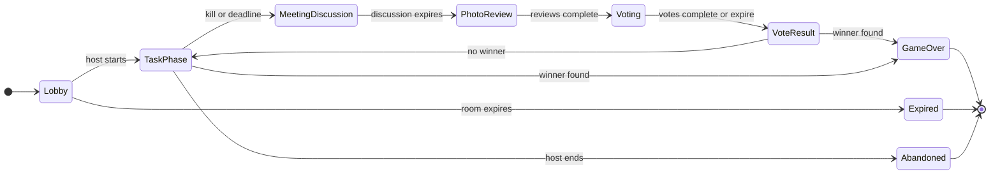

# Master Architecture Plan

**Status:** Approved for phased implementation  
**Planning baseline:** 2026-09-20  
**Implementation status:** Phases 1–6 implemented; PostgreSQL integration verification runs in CI

## 1. Product overview

### What we are building

A room-based social deduction game played by people in the same physical environment. A host creates a temporary room, players join with nicknames, the server secretly assigns crew and imposter roles, and players complete real-world tasks with photo evidence. The application coordinates task progress, eliminations, meetings, evidence challenges, voting, and win detection.

The first complete client will be a responsive web application. A native Android client will follow and will use the same backend contracts. iOS and other clients may be added later without creating a second backend.

### Problem it solves

Traditional social deduction games require a moderator or rely on manually coordinated roles, timers, evidence, and votes. This product gives a small in-person group a private game coordinator without GPS, indoor positioning, proximity sensing, or a dedicated moderator.

### Main actors

| Actor                  | Description                                   | Primary capabilities                                                           |
| ---------------------- | --------------------------------------------- | ------------------------------------------------------------------------------ |
| Host player            | Temporary room participant who controls setup | Configure and start a game, end an abandoned game                              |
| Crew player            | Secret role in an active game                 | Complete assigned tasks, upload evidence, flag evidence, discuss and vote      |
| Imposter player        | Secret adversarial role                       | Receive fake tasks, eliminate valid targets, participate in meetings and votes |
| Eliminated player      | Killed or ejected participant                 | Observe permitted state; crew may continue tasks in ghost mode                 |
| Platform administrator | Product owner, not a game moderator           | Create, edit, publish, archive, and inspect task packs                         |
| System worker          | Internal actor                                | Advance expired phases, process images, expire rooms, delete retained media    |

### Main use cases

1. An administrator publishes a task pack.
2. A host creates a room and shares its short code.
3. Players join using unique nicknames and receive private room-scoped sessions.
4. The host configures safe game settings and starts the game.
5. The server snapshots the pack, assigns roles, and assigns real or fake tasks.
6. Players upload evidence and may flag other players' evidence.
7. An imposter eliminates a living target; the server starts an anonymous meeting.
8. Players review flagged evidence, discuss in person, and cast secret votes.
9. The server resolves the meeting and checks all win conditions transactionally.
10. Disconnected clients reconnect and receive an authorized current snapshot.

## 2. Product decisions

### Fixed decisions inherited from the concept

- No GPS, location tracking, proximity detection, or spatial maps.
- Task packs are themed text lists managed by the platform owner.
- Photo submissions are initially accepted without a dedicated moderator.
- Players may challenge suspicious evidence during a later meeting.
- No persistent player accounts are required for the MVP.
- PostgreSQL is the source of truth and object storage holds photos.
- The production server must be a persistent Node process capable of WebSocket connections.

### Final MVP rules

| Topic                 | Proposed default                                                                         | Reason                                                                         |
| --------------------- | ---------------------------------------------------------------------------------------- | ------------------------------------------------------------------------------ |
| Player count          | 4–12                                                                                     | Keeps meetings, physical coordination, and payload size manageable             |
| Imposters             | 1 for 4–7 players; 2 for 8–12                                                            | Fixed automatic balancing avoids unsafe host configurations                    |
| Tasks per crew member | 3 for 4–7 players; 4 for 8–12 players                                                    | Longer games receive slightly more task pressure without excessive uploads     |
| Kill behavior         | A valid kill privately eliminates the target and immediately starts an anonymous meeting | Avoids unverifiable physical body discovery                                    |
| Discussion            | Spoken in person; app shows timer, evidence, roster, and controls                        | Avoids chat moderation and preserves the in-person premise                     |
| Eliminated crew       | May finish assigned real tasks but cannot flag, kill, review, or vote                    | Prevents a kill from making task victory impossible                            |
| Evidence review       | Living players vote valid/invalid before the ejection vote                               | Gives “resolved during the meeting” an enforceable meaning                     |
| Review tie            | Submission remains valid                                                                 | Avoids punishment without a majority                                           |
| Ejection tie          | No player is ejected                                                                     | Simple and predictable                                                         |
| Vote visibility       | Totals revealed after voting closes; individual votes remain secret                      | Limits vote manipulation and social pressure                                   |
| Task victory          | All real crew assignments are complete, including ghost tasks                            | Fake imposter completions never count                                          |
| Meeting triggers      | Kill or server task-phase deadline; no host emergency meeting in the MVP                 | Prevents the host from gaining special gameplay influence                      |
| Hosting               | One persistent application instance initially                                            | Avoids premature distributed realtime infrastructure                           |
| Photo retention       | Delete within 24 hours after game completion/expiry; delete orphaned uploads sooner      | Privacy-conscious default for a casual game                                    |
| Participant age       | MVP is 18+ with self-attestation; do not collect date of birth                           | Avoids knowingly operating a photo-sharing game for minors before legal review |

### Resolved design decisions

The seven previously open gameplay/privacy decisions are now fixed for the MVP:

1. A successful kill immediately starts an anonymous meeting; there is no later manual body report.
2. Eliminated crew enter ghost mode and may finish their real tasks, but cannot influence meetings.
3. Flagged evidence receives a separate living-player validity vote before ejection voting. A tie keeps the evidence valid.
4. Discussion is intentionally in-person voice discussion. The MVP does not include text or voice chat.
5. Rooms support 4–12 players. Games use one imposter and three tasks per crew member for 4–7 players; two imposters and four tasks per crew member for 8–12 players.
6. Hosts cannot trigger emergency meetings in the MVP. Meetings begin after a kill or task-phase deadline.
7. The MVP is 18+. Photos are private to the room and deleted within 24 hours after a game completes or expires; orphaned/rejected uploads are deleted sooner.

Recommended pre-upload notice:

> Photos are visible to players in this room and are used only to run this game. Do not photograph anyone without permission or include sensitive documents. Game photos are deleted within 24 hours after the game ends or expires. By continuing, you confirm that you are at least 18 and have permission to upload this photo.

This wording is a product baseline, not a substitute for jurisdiction-specific legal review before a public launch.

## 3. Core business rules

### Room and membership

- Room codes identify rooms but do not authenticate players.
- A successful join creates an opaque, revocable, room-scoped participant session.
- Nicknames are unique within a room after case-folding and whitespace normalization.
- New participants cannot join after the game starts; existing participants may reconnect.
- One participant is the host. Host transfer occurs after a configurable disconnect grace period.
- Host powers do not reveal secret roles or permit changing game outcomes.

### Role and task assignment

- The server uses cryptographically secure randomness for role assignment.
- The number of imposters must be valid for the participant count.
- Published task-pack items are copied into immutable game task snapshots at game start.
- Crew assignments count toward team progress. Imposter assignments are believable decoys and do not count.
- No client receives another participant's role or whether an assignment counts toward progress.

### Game state machine



- Every command declares the current expected state version.
- The server validates actor, authorization, phase, deadline, and command preconditions.
- State changes, event creation, and win checks occur in one database transaction.
- Each committed state change increments `games.state_version`.
- Realtime messages are hints that new state exists; PostgreSQL remains authoritative.

### Win conditions

Run after every action that can affect player life status or real task progress:

1. Crew wins if no living imposters remain.
2. Crew wins if every real crew assignment is complete.
3. Imposters win if at least one imposter remains and living imposters are greater than or equal to living crew.
4. Otherwise the game continues.

The precedence above matters in theoretically simultaneous outcomes and must be covered by tests.

### Evidence review

- Upload confirmation immediately completes the assignment provisionally.
- One participant may flag a particular submission once and cannot flag their own submission.
- Flagging does not immediately reverse completion.
- The next meeting creates an evidence-review item for each unresolved flagged submission.
- Only living, eligible participants may vote on review items.
- A majority of cast eligible votes marks the evidence invalid and reopens the task.
- A tie or no votes leaves the evidence valid.
- Each review resolution is permanent and auditable.

## 4. System architecture summary

The system is a modular monolith: one deployable Node application with internal boundaries for HTTP, realtime transport, application services, domain rules, persistence, storage, jobs, and observability. See `ARCHITECTURE.md` for module and deployment detail.

```text
Web client ─┐
            ├── HTTPS REST API ──┐
Android ────┤                    ├── Modular Node application
Future apps ┘   WebSocket ───────┘       │
                                          ├── PostgreSQL
                                          ├── Private object storage
                                          └── In-process worker/scheduler
```

### Backend responsibilities

- Participant and administrator authentication.
- Host, player, role, life-state, and resource authorization.
- Validation, normalization, rate limiting, and consistent errors.
- Room lifecycle, role assignment, task assignment, state transitions, voting, and win rules.
- Transactions, locking, idempotency, and state versioning.
- Object keys, upload permission, media verification, retention, and deletion.
- Player-specific DTO projection so secret data is never serialized to unauthorized clients.
- Realtime subscriptions and recovery snapshots.
- Timers, cleanup jobs, health checks, structured logs, metrics, and audit events.

### Client responsibilities

- Rendering authorized DTOs and realtime snapshots.
- Collecting input and performing presentation-only validation.
- Local navigation, pending indicators, retry prompts, camera/file selection, and accessibility.
- Securely retaining the participant session through the platform-appropriate mechanism.
- Resynchronizing from the server after reconnection or version gaps.

Clients must not assign roles, determine winners, resolve votes, count authoritative tasks, create object keys, or infer hidden state.

## 5. API strategy

- Public contract prefix: `/api/v1`.
- JSON over HTTPS for commands and queries.
- WebSocket connection for subscriptions, presence hints, and authorized state updates.
- REST commands are authoritative; WebSocket delivery never substitutes for a committed response.
- OpenAPI 3.1 becomes the machine-readable HTTP source of truth during Phase 1.
- Realtime events receive a separate versioned schema catalog.
- Database records are mapped to DTOs; ORM entities are never returned directly.
- All mutation endpoints support an `Idempotency-Key` where retries could duplicate effects.
- Errors follow one envelope with stable machine-readable codes and a request correlation ID.

The initial API surface is defined in `API_CONTRACT.md`.

## 6. Authentication and authorization summary

### Participants

Players do not register. Creating or joining a room issues a high-entropy opaque session token. Only its hash is stored. Sessions are scoped to one participant and one room, expire with the room, can be rotated on reconnect, and can be revoked.

The same credential semantics work for web and Android:

- Native clients send `Authorization: Bearer <token>` and store the token in OS-protected storage.
- The same-origin web client should use a Secure, HttpOnly, SameSite cookie through a thin web session adapter. The application authentication service accepts either transport and resolves the same participant session.

### Administrators

Administrative access is separate from player sessions. Registration is disabled. An administrator is provisioned out of band, uses a hashed password, and receives a short-lived server-side session. Admin routes require explicit admin authorization and stronger rate limits.

### Authorization matrix

| Operation                   |      Host | Living player | Eliminated player | Imposter only | Admin |
| --------------------------- | --------: | ------------: | ----------------: | ------------: | ----: |
| Change lobby settings       |       Yes |            No |                No |            No |    No |
| Start game                  |       Yes |            No |                No |            No |    No |
| View own role/tasks         |       Yes |           Yes |               Yes |            No |    No |
| Complete real assigned task |   If crew |           Yes |   Crew ghost only |            No |    No |
| Eliminate target            |        No |            No |                No |           Yes |    No |
| Flag evidence               | If living |           Yes |                No |            No |    No |
| Review and eject vote       | If living |           Yes |                No |            No |    No |
| Manage packs                |        No |            No |                No |            No |   Yes |

Detailed controls and threat rationale are in `SECURITY.md`.

## 7. Data persistence and lifecycle

PostgreSQL stores administrators, task packs, rooms, participant sessions, games, role membership, task snapshots and assignments, evidence metadata, flags, meetings, votes, eliminations, idempotency records, and game events.

Object storage contains only private photo objects. The database stores object keys and verified metadata, never permanent public URLs. Game completion schedules deletion; records retain non-sensitive audit facts after the object is deleted.

Room/game retention recommendation:

- Lobby with no activity: expire after 2 hours.
- Active game: expire or become abandoned after 12 hours without activity.
- Photos: delete 24 hours after completion/expiry.
- Participant tokens: revoke at completion and delete with expired-room cleanup.
- Aggregate operational metrics: retain without nicknames or images.

Full proposed schema is in `DATABASE_DESIGN.md`.

## 8. Reliability and concurrency

- Lock the game row before transitions that can conflict.
- Use deterministic service methods and transaction-scoped win checks.
- Store phase deadlines rather than relying on process memory.
- A scheduler finds expired phases and claims work transactionally.
- Use idempotency records for retried joins, starts, upload confirmations, kills, flags, and votes.
- A client that sees a state-version gap fetches a complete authorized snapshot.
- Graceful shutdown stops accepting commands, drains requests, and closes sockets after a bounded interval.
- A server restart may interrupt connections but must not lose game state or deadlines.

## 9. Infrastructure

### Initial production footprint

- One persistent Node application process/container.
- Managed PostgreSQL with automated backups and connection pooling.
- Private S3-compatible object storage with lifecycle policies.
- TLS-terminating platform proxy or Nginx with WebSocket upgrade support.
- Centralized application logs and external error tracking.
- CI checks for linting, type checking, tests, migrations, and contract validation.

No Redis, message broker, Kubernetes, or microservices are required initially.

### Scale-out trigger

Add multiple application instances only when concurrency or availability data justifies it. Before scale-out, introduce:

- Shared realtime room coordination/pub-sub.
- Sticky sessions only if the chosen realtime adapter requires them.
- Distributed job claiming/leases.
- Coordinated Next.js cache behavior.
- Load tests proving connection and transaction behavior.

## 10. Observability

- Structured JSON logs with timestamp, level, service version, request ID, room/game identifiers, and safe actor identifiers.
- Never log raw tokens, role assignment payloads, signed storage URLs, or photo contents.
- Metrics for active connections, active rooms, command latency/error rate, reconnects, deadline lag, upload failures, database pool saturation, and job failures.
- Liveness endpoint checks the process only.
- Readiness endpoint checks critical dependencies with strict timeouts.
- Audit events capture administrative changes and security-relevant session activity.

## 11. Testing strategy

1. **Domain unit tests:** state transitions, role/task distribution, vote resolution, evidence review, win precedence.
2. **Application-service tests:** authorization, idempotency, DTO redaction, deadline handling.
3. **Database integration tests:** constraints, transactions, concurrent kill/vote races, pack snapshots.
4. **API contract tests:** validation, error envelopes, authentication, backward compatibility.
5. **Realtime tests:** authorized room subscription, reconnect snapshot, version gaps, role secrecy.
6. **Storage tests:** upload intent scope, confirmation, invalid type/size, cleanup.
7. **End-to-end tests:** several isolated browser/API participants complete a full game.
8. **Operational tests:** restart during active phase, expired deadline recovery, database/object-store outage behavior.

Coverage percentage is secondary to exhaustive tests of secret-data boundaries and state-machine invariants.

## 12. Dependency-ordered delivery

| Phase | Outcome                                                                               |
| ----- | ------------------------------------------------------------------------------------- |
| 01    | Backend foundation, contract conventions, observability, and database harness         |
| 02    | Administrator authentication and task-pack lifecycle                                  |
| 03    | Room creation, guest sessions, lobby, presence, and reconnect                         |
| 04    | Game start, role/task assignment, task progress, and state snapshots                  |
| 05    | Private evidence upload, confirmation, flags, processing, and retention               |
| 06    | Kill, meetings, evidence review, ejection voting, timers, and win resolution          |
| 07    | Recovery, security hardening, load/operational tests, deployment, and contract freeze |

Detailed entry/exit criteria are in `docs/phases/`.

## 13. Intentionally deferred

- Persistent player accounts, profiles, friends, history, and matchmaking.
- Remote text/voice chat.
- GPS, proximity, maps, and automated kill verification.
- Push notifications.
- iOS client.
- Spectator and dedicated moderator roles.
- User-created public task packs and marketplace moderation.
- Redis, external queues, multiple backend services, and multi-region deployment.
- Analytics based on identifiable player or photo data.

## 14. Architecture approval checklist

- [x] MVP game-rule defaults resolved.
- [x] Guest-session and admin-authentication strategy accepted.
- [x] REST-command/realtime-snapshot split accepted.
- [x] Database entities and deletion behavior accepted.
- [x] Photo retention and 18+ privacy baseline resolved.
- [x] Single-instance initial deployment accepted.
- [x] Phase order accepted.
- [x] Phase 1 explicitly authorized.

The architecture approval gate is resolved. Each later phase still requires its own implementation and verification.
